# Programming Guide

## Create a project

With [Hybridizer Essentials](https://marketplace.visualstudio.com/items?itemName=altimesh.AltimeshHybridizerExtensionEssentials), creating a C# project with Hybridizer is as easy as any C# project:

- Open Visual Studio (2012 to 2017)
- Click File -> New -> Project
- Visual C# -> Altimesh
- Choose your target flavor (CUDA 8 to 10 or AVX)


With Hybridizer Software Suite, generated project must be modified to use the appropriate version of Hybridizer and appropriate settings. You can also modify generated project by using this [template](../files/template_CUDA.vcxproj). 
Or you can do everything manually by adding a new CUDA project to your solution, import the Hybridizer build customization (from install path) and fill the required fields. 

More details can be found [here](http://www.altimesh.com/get-started/)

## Compilation Process

### Basics
For all targets, compilation process is very similar. We will show the differences, then focus on the CUDA target for clarity. 

In all cases, input is the MSIL (MicroSoft Intermediate Language) generated from C#, F# or VB.Net by .Net or Mono. 

#### CUDA 


Hybridizer takes that MSIL, reads attributes and generates CUDA code. This code is then compiled and linked by the NVIDIA compiler (nvcc) into a CUDA binary. 

#### AVX


Hybridizer takes that MSIL, reads attributes and generates C++ code. This code relies on a small vector library (*phivect*), implemented as part of a backend compiler. This backend compiler is a fork of clang/LLVM, in which we integrated this library, as well as some critical optimizations. 
In the end, we get x86 binary, containing AVX, AVX2 or AVX512 instructions instead of scalar.

### In depth

What happens behind the hood: 

#### Input
- Assemblies
- Builtins file (maps internal .Net types to native implementation
- MSBuild settings

#### MSBuild task
- Invoke satellite (here to support both x86/x64)
- Generates base config (hybridizer.base.config)

#### Build Satellite
- Reads base config
- Generates detailed config file (hybridizer.config)
- Invokes Hybridizer

#### Hybridizer
- Reads assemblies, builtins and config file
- Generates native code

#### nvcc/clang
- Reads native code and intrinsincs
- Generates native dll

### Identify Methods To Process

Code modification is based on attributes, which comes at zero cost at runtime when running the .Net application. 
These attributes mimic CUDA memory attributes:
- `EntryPoint` for `__global__`
- `Kernel` for `__device__`

From that, call graph is walked automatically. 

the previous hello world sample can be written in C#: 

```csharp
[EntryPoint]
public static void add(int N, double[] a, double x) 
{
    int tid = threadIdx.x + blockIdx.x * blockDim.x;
    int step = gridDim.x * blockDim.x;
    while (tid < N) {
        a[tid] += x;
        tid += step;
    }
}
```

The `EntryPoint` attribute tells Hybridizer to process the method. It then process the method body, walks the call graph if nessary, and generates native code. 
`threadIdx` and others are provided by `Hybridizer.Runtime.CUDAImports` runtime library. It could also be written using a `Parallel.For`: 


```csharp
[EntryPoint]
public static void add(int N, double[] a, double x) 
{
    Parallel.For(0, N, i => { a[i] += x; });
}
```

### Invoke Generated Code

Native dll exports symbols for each `EntryPoint`. These symbols can be called directly using `DllImport`, or used transparently from .Net using `HybRunner`:

#### HybRunner

```csharp
HybRunner runner = HybRunner.Cuda();          // register native dll
dynamic wrapped = runner.Wrap(new Program()); // wrap current object
wrapped.Run(N, a, x);                         // invoke generated method
```

In this code: 

- `HybRunner.Cuda(string path = null)` finds the native dll and read its properties
- `runner.Wrap(o)` generates a dynamic object by reflection containing the same method signatures as `o` but running in CUDA or AVX of .Net. 
- `wrapped.Run(...)` takes care of memory management and invokes the GPU or AVX function.

Grid configuration is automatically set up to 16 blocks of 128 threads per SM. User can configure it using `SetDistrib` method on runner or wrapped object. 

#### DllImport

We could also invoke the native library by using `DllImport`:

```csharp
[DllImport("mydll_CUDA.dll", CallingConvention = CallingConvention.Cdecl, Charset = Charset.Ansi)]
public static extern int add_ExternCWrapper_CUDA(int, int, int, int, int, int, int N, IntPtr a, double x);

public static void Main() 
{
  cuda.Malloc(out d_a, N * sizeof(double));
  cuda.Memcpy(d_a, a, N * sizeof(double), cuda.MemcpyHostToDevice);
  add_ExternCWrapper_CUDA(/*grid configuration*/, N, d_a, x);
  /// ...
}
```

This method is quite heavy, but offers complete control. It should be used by advanced users only. 

### Generated Code

With Hybridizer Essentials, only two files are generated : hybridizer.generated.cpp and hybridizer.wrapper.cu. The former is only the cubin of your kernels (stored as byte array), and the latter exports symbols. 
With Software Suite, the full code is output: 

- hybridizer.includes.cuda.h 
  - type declaration, export symbols
- className.cu 
  - method implementations for className (1 file per class)
- hybridizer.dispatch.cuda.cu
  - exports utilities for marshalling
  - contains virtual functions tables
- hybridizer.all.cuda.cu 
  - main file including all the others (the one to compile)


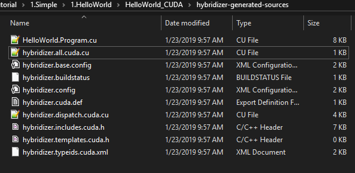

The looks like what is written in C#. Scopes are reconstructed, loops are rebuilt (if option chosen), and variable names are preserved:

For example: 
```csharp
struct MaxReductor : IReductor
{
  [Kernel]
  public float neutral { get { return float.MinValue; } }

  [Kernel]
  public float func(float x, float y)
  {
    return Math.Max(x, y);
  }
}
```

yields in hybridizer.includes.cuda.h:

```c++
struct MaxReductor
{
  static inline hyb_device int hybridizer_typeid () { return 3 ; }
  static inline hyb_device const char* hybridizer_typename ()
  { 
    return "GenericReduction.MaxReductor" ; 
  }

  hyb_device float get_neutral() ;
  hyb_device float func( float x,  float y) ;
  __host__ hyb_device  MaxReductor () { }
  __host__ hyb_device  MaxReductor (const MaxReductor& __hybrid_inst) { }
};
```
In the generated code, type contains a `typeid` field, used to generate dispatch tables for virtual functions and a `typename` field, used for marshalling (C#/Native interop). 

In the implementation file (MaxReductor.cu), we have:

```c++
hyb_device float GenericReduction::MaxReductor :: get_neutral()
{
  ::GenericReduction::MaxReductor* __hybridizer_pself = this;
  {
    {
      return -3.40282347E+38f ;
    }
  }
}

hyb_device float GenericReduction::MaxReductor :: func( float x,  float y)
{
  ::GenericReduction::MaxReductor* __hybridizer_pself = this;
  {
    {
      return max ( x, y ) ;
    }
  }
}
```

## Features

### Intrinsics
Sometimes, it's difficult (or impossible) to express a CUDA concept in .Net. Some other times, user already have an extremely tuned CUDA or AVX function and doesn't want to get rid of it. 
Hybridizer provides *Intrinsics* for that purpose. 

```csharp
[IntrinsicInclude("../intrinsics.cuh")]
class Intrinsics
{
  [IntrinsicFunction("myfunc")]
  public static float MyFunc(float x)
  {
	// anything in .Net : throw, or provide implementation
  }
}
```

- `IntrinsicInclude` attributes tells Hybridizer to include `intrinsics.cuh` each time the class `Intrinsics` is used;
- `IntrinsicFunction` attributes tells Hybridizer to not process the method, and replace calls to `MyFunc` by raw calls to the CUDA/AVX function `myfunc`.

It can also be useful to use CUDA runtime functions from .Net, for example the [Math API](https://docs.nvidia.com/cuda/cuda-math-api/index.html). In that case, since functions are provided directly by the cuda runtime, `IntrinsicInclude` has to be removed:

```csharp
class Program
{
	[IntrinsicFunction("tgammaf")]
	public static float Gamma(float x)
	{
		// provide implementation or throw
	}
}
```

will replace calls to `Gamma` functions by calls to [tgamma](https://docs.nvidia.com/cuda/cuda-math-api/group__CUDA__MATH__SINGLE.html#group__CUDA__MATH__SINGLE_1g0e556a6b5d691277e3234f4548d9ae23) CUDA function. 

### Builtins
It's often desirable to have the same mechanism on code we can't control C# code (System function, third party library). It's then impossible to use IntrinsicFunctions. Hybridizer provides a *builtin* system:

```xml
<Functions>
	<BuiltInFunction DeclaringType="System.Threading.Interlocked" MethodName="Add">
	  <MethodParameters>
		<string>System.Int32&amp;</string>
		<string>System.Int32</string>
	  </MethodParameters>
	  <IntrinsicFunction>
		<Name>atomicAdd</Name>
	  </IntrinsicFunction>
	</BuiltInFunction>
</Functions>
```

The xml content above has to be saved in a *builtins* file, added to the native project, and passed to hybridizer: 

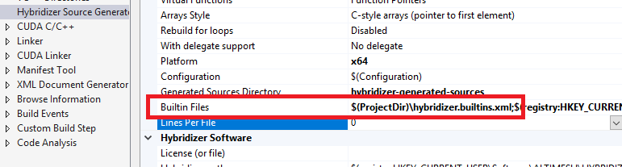

Builtin files can also provide builtins types (such as `Nullable<T>`). 

This system has two main limitations:

- no generic methods
- no IntrinsicInclude system

### Default Marshalling
`runner.Wrap(o)` creates a dynamic object at runtime via reflection. That object contains the same methods as original object (with overloads). In addition, it contains `DllImport` methods for direct interop:

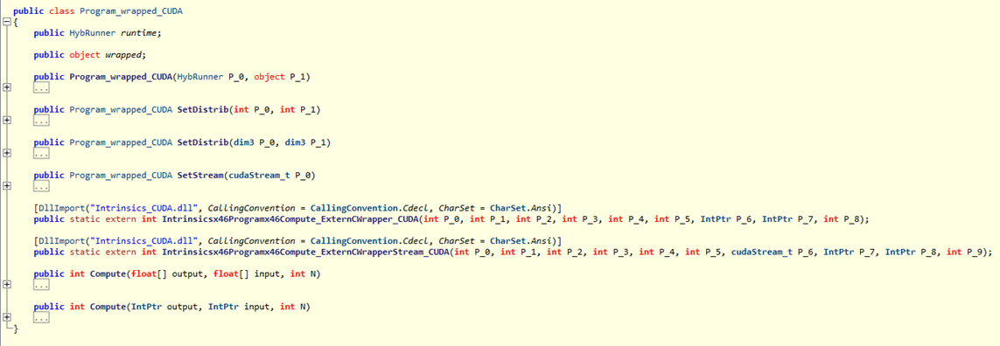

Invoking the generated methods then does quite a job:

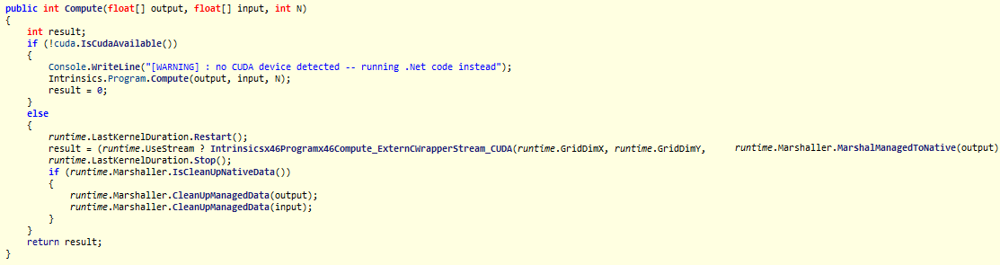

The default marshaller does the following operations at each kernel invocation:
- Marshalling
  - Compute object size
  - Pin object (`GCHandle.Alloc(o)`, `handle.AddrOfPinnedObject()`)
  - Allocate device memory (`cuda.Malloc(...)`)
  - Copy data to GPU (`cuda.Memcpy(...)`)
- UnMarshalling
  - Copy data back to host
  - Free memory on GPU
  - Unpin object (`handle.Free()`)
  
Those operations are necessary because of the different levels of memory (managed, paged, physical), which are not all accessible from the entire CUDA api :

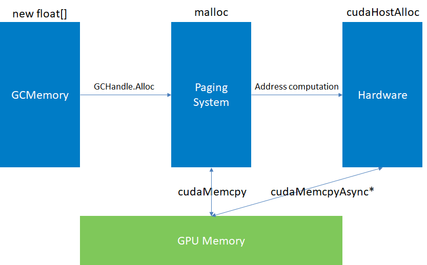

- Managed memory is volatile by essence. Garbage collector can move it around, preventing any native API call on it, such as `cuda.Memcpy`
- Paged memory, obtained using `GCHandle.Alloc()` or native memory allocation (`malloc`) yields [virtual addresses](https://en.wikipedia.org/wiki/Virtual_memory), controlled by the operating system
- Physical memory is the actual memory address, therefore accessible from CUDA driver (memcpyAsync). This part will be discussed later, with `streams`

### Line Information

Line information feature injects original source lines into generated code:

```cpp
__global__ void Intrinsicsx46Programx46Compute( hybridizer::runtime* __hybridizer_runtime,  float* const output,  float* const input,  int N)
{
	hybridizer::initruntime (__hybridizer_runtime) ;
	::Intrinsics::Program___c__DisplayClass1_0   CSx36x60x628__locals0 ; // Intrinsics.Program+<>c__DisplayClass1_0 (0)
	{
		#line 36 "W:\\hybridizer-tutorial\\1.Simple\\3.Intrinsics\\Intrinsics\\Program.cs" 
		CSx36x60x628__locals0 =  ::Intrinsics::Program___c__DisplayClass1_0 (  ) ;
		#line 36 "W:\\hybridizer-tutorial\\1.Simple\\3.Intrinsics\\Intrinsics\\Program.cs" 
		CSx36x60x628__locals0 . output = output ;
		#line 36 "W:\\hybridizer-tutorial\\1.Simple\\3.Intrinsics\\Intrinsics\\Program.cs" 
		CSx36x60x628__locals0 . input = input ;
		#line 36 "W:\\hybridizer-tutorial\\1.Simple\\3.Intrinsics\\Intrinsics\\Program.cs" 
		#line 37 "W:\\hybridizer-tutorial\\1.Simple\\3.Intrinsics\\Intrinsics\\Program.cs" 
		::hybridizer::parallelfor (  0 , N,  hybridizer::action< int > ( &(CSx36x60x628__locals0), (void*)(Intrinsicsx46Programx43x60x62c__DisplayClass1_0_x60Computex62b__0_I) )  ) ;
		#line 41 "W:\\hybridizer-tutorial\\1.Simple\\3.Intrinsics\\Intrinsics\\Program.cs" 
		return ;
	}
}
```

This is mandatory to get C# debugging, or to have source view in profiling. 

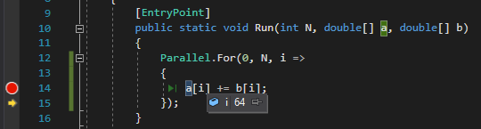

It is activated (or not), from the *Hybridizer Source Generator" panel in the native project properties:

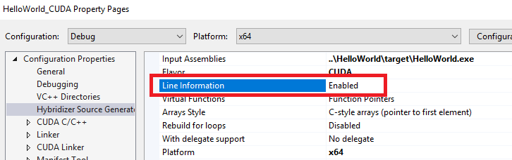

Desactivating it can be useful to be able to debug generated code (enable native code debuggin in .Net project). 

### Virtual functions

Hybridizer provides support for [virtual functions](https://docs.microsoft.com/en-us/dotnet/csharp/language-reference/keywords/virtual). 

Here is a small sample : 
```csharp
interface IReductor
{
	[Kernel]
	float neutral { get; }

	[Kernel]
	float func(float x, float y);
}

class AddReductor : IReductor
{
	[Kernel]
	public float neutral { get { return 0.0F; } }

	[Kernel]
	public float func(float x, float y)
	{
		return x + y;
	}
}

[EntryPoint]
public void Reduce(IReductor reductor, float[] result, float[] input, int N)
{
	// perform actual reduction
}

public static void Main() 
{
    // ...
	wrapped.Reduce(new AddReductor(), buffAdd, a, N);
	// ...
}
```

Please note that both interface and implementation methods *must* be decorated with `Kernel`. 

Hybridizer generates a dispatch table for each virtual function. The appropriate function is then retrieved based on the instance `typeid`. 

```cpp
typedef float (*GenericReductionx46IReductor_get_neutral_1__DispatchantType)(::GenericReduction::IReductor*) ;

// building dispatch table 
// Pure Virtual Signaling method
hyb_device float GenericReductionx46IReductor_get_neutral__PureVirtual( GenericReduction::IReductor* const __hybridizer_pself)
{
	HYBRIDIZER_SIGNAL_PURE_VIRTUAL("GenericReduction.IReductor :: get_neutral", HYBRIDIZER_GETTYPE_ID(__hybridizer_pself)) ;
	return (float) 0 ;
}

hyb_device  GenericReductionx46IReductor_get_neutral_1__DispatchantType g_table_GenericReductionx46IReductor_get_neutral_1__DispatchantType [] = {
	(GenericReductionx46IReductor_get_neutral_1__DispatchantType) GenericReductionx46IReductor_get_neutral__PureVirtual, // abstract 
	(GenericReductionx46IReductor_get_neutral_1__DispatchantType) GenericReductionx46AddReductor_get_neutral_,           // AddReductor typeid
	(GenericReductionx46IReductor_get_neutral_1__DispatchantType) GenericReductionx46IReductor_get_neutral__PureVirtual, // abstract
	(GenericReductionx46IReductor_get_neutral_1__DispatchantType) GenericReductionx46MaxReductor_get_neutral_            // MaxReductor typeid
} ;

// Dispatching function
hyb_device float GenericReductionx46IReductor_get_neutral__Dispatch( GenericReduction::IReductor* const __hybridizer_pself)
{
	GenericReductionx46IReductor_get_neutral_1__DispatchantType __hybridizer_func = g_table_GenericReductionx46IReductor_get_neutral_1__DispatchantType [HYBRIDIZER_GETTYPE_ID(__hybridizer_pself)] ;
	return __hybridizer_func (__hybridizer_pself) ;
}

// Declaring interface stub
hyb_device float GenericReduction::IReductor::get_neutral () { return  GenericReductionx46IReductor_get_neutral__Dispatch (this) ; }
```

Virtual functions therefore introduce a level of indirection which cannot be optimized out by the compiler (since the information is only available at runtime). 

This has a significant cost at runtime. Here is a profiling of a reduction using virtual functions : 

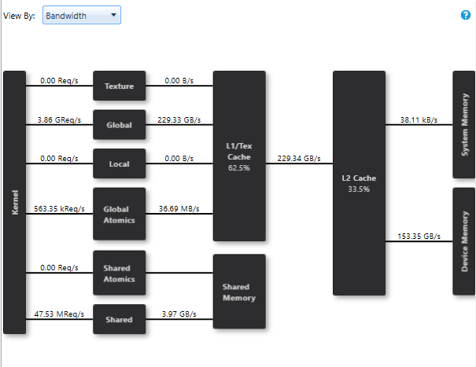

We reach a bandwidth of 153GB/s on a GeForce 1080 Ti, a desappointing 43% of peak memory bandwith. 

It has to be noted that Hybridizer provides two option for virtual functions generation:

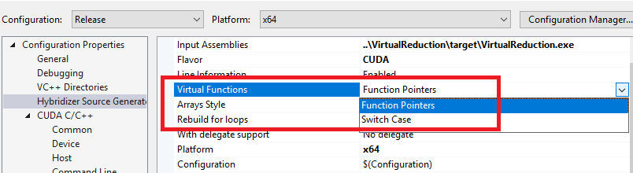

The first one (function pointers), is the default one, generating dispatch tables. The second is *deprecated* and only useful for OpenCL target (which has no function pointer). 


### Generics

Hybridizer supports generic types (and **not generic functions**). They are mapped on C++ templates, which are resolved at compile time, allowing inlining. 
It's usually way more efficient to write code using generic types rather than virtual functions. 
Here is the same reduction, written using generics:

```csharp
[HybridTemplateConcept]
interface IReductor
{
	[Kernel]
	float func(float x, float y);
	[Kernel]
	float neutral { get; }
}

struct AddReductor: IReductor
{
	[Kernel]
	public float neutral { get { return 0.0F; } }

	[Kernel]
	public float func(float x, float y)
	{
		return x + y;
	}
}

[HybridRegisterTemplate(Specialize = typeof(GridReductor<MaxReductor>))]
[HybridRegisterTemplate(Specialize = typeof(GridReductor<AddReductor>))]
class GridReductor<TReductor> where TReductor : struct, IReductor
{
	[Kernel]
	TReductor reductor { get { return default(TReductor); } }

	[Kernel]
	public void Reduce(float[] result, float[] input, int N)
	{
		// perform actual reduction
	}
}
```

As stated, we generate a template structure:

```cpp
namespace GenericReduction { 
template < typename TReductor > struct GridReductor
		: hybridizer::hybridobject
{
	static inline hyb_device int hybridizer_typeid () { return 0 ; }
	static inline hyb_device const char* hybridizer_typename () { return "GenericReduction.GridReductor<T0>" ; }

	hyb_device void Reduce( float* const result,  float* const input,  int N) ;
	hyb_device TReductor get_reductor() ;
	GridReductor () { } // Default constructor added by Hybridizer to allow instantiation
} ;
} // Leaving namespace
```

The attributes `HybridizerRegisterTemplate(...)` then tells Hybridizer to generate the appropriate [template specializations](https://en.cppreference.com/w/cpp/language/template_specialization). Since the method parameter is then passed at compile time, 
backend compiler (nvcc or clang), can inline the call. Performance is restored: 

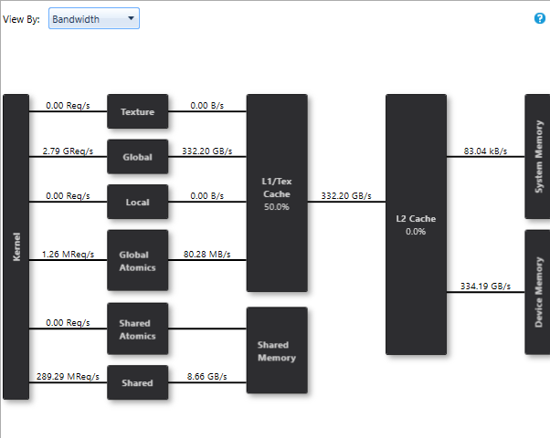

### Delegates and Lambdas

Hybridizer supports delegates and [lambda expressions](https://docs.microsoft.com/en-us/dotnet/csharp/programming-guide/statements-expressions-operators/lambda-expressions). 
Delegates, or genereric predefined delegates, are function objects, such as `delegate`, `Func<>` or `Action<>`. They can then be invoked, stored in fields, or passed as arguments to other functions. 
They are mapped to function pointers in device code. These function pointers (when static), are stored as template objects in constant memory (very fast local cache). Most of the time, nvcc and clang are then able to inline it. 

#### Compile time constants delegates
The above reduction sample can be rewritten using funcs : 

```csharp
[Kernel]
public static void InnerReduce(float[] result, float[] input, int N, float neutral, Func<float, float, float> reductor)
{
	// perform reduction
}

// specialize
[EntryPoint]
public static void ReduceAdd(float[] result, float[] input, int N)
{
	InnerReduce(result, input, N, 0.0F, (x, y) => x + y);
}
```


This generates the following CUDA code (OMP or AVX would be similar):

```cpp
// main function
void LambdaReductionx46Program_InnerReduce_FaFaIFG_X0_FFF_H(float* const result, float* const input, int N, float neutral, hybridizer::func2<float, float, float> reductor);

// invocation
LambdaReductionx46Program_InnerReduce_FaFaIFG_X0_FFF_H ( result, input, N, 0.0f, LambdaReductionx46Programx43x60x62c______9__1_0 );

// declaration of function pointer
static hyb_constant hybridizer::func2_capture_static<::LambdaReduction::Program___c,float,float,float, LambdaReductionx46Programx43x60x62c_x60ReduceAddx62b__1_0_FF> LambdaReductionx46Programx43x60x62c______9__1_0 ;

// function pointer implementation
hyb_device float LambdaReductionx46Programx43x60x62c_x60ReduceAddx62b__1_0_FF( LambdaReduction::Program___c* const __hybridizer_pself,  float x,  float y)
{
  return ( x + y ) ;
}
```

In that case, actual lambda is known at compile time, leading to this `func2_capture_static` object, which allows function inlining and optimal performance (33GB/s, 94% of peak on GeForce 1080 Ti). 

#### Runtime defined delegates

It is sometimes interesting to define function parameters at runtime. This is supported, as shown by this example: 

```csharp
class RuntimeGridReductor
{
	Func<float, float, float> localReductor;
	float neutral;

	public RuntimeGridReductor(Func<float, float, float> func, float n)
	{
		localReductor = func;
		neutral = n;
	}

	[EntryPoint]
	public void Reduce(float[] result, float[] input, int N)
	{
		/// perform reduction
	}
}

class AddReductor
{
	[Kernel]
	public static float func(float x, float y)
	{
		return x + y;
	}
}

public static void Main() 
{
	// ...
	var reductor = new RuntimeGridReductor(AddReductor.func, 0.0F);
	dynamic wrapped = runner.Wrap(reductor);
}
``` 

In that case, Hybridizer will generate a device function pointer (in constant memory) for `AddReductor.func`. This pointer will be stored in the device instance of `RuntimeGridReductor` and invoked. 
It has to be a member static function, as it needs to be the same object used for marshalling and in device code (passing (x, y) => x+y wouldn't work, as it would create another function object). 
This is handy, but **extremely costly** at runtime. 
Indeed, all local reduction operation now have a memory dependency on the local reductor function pointer. 

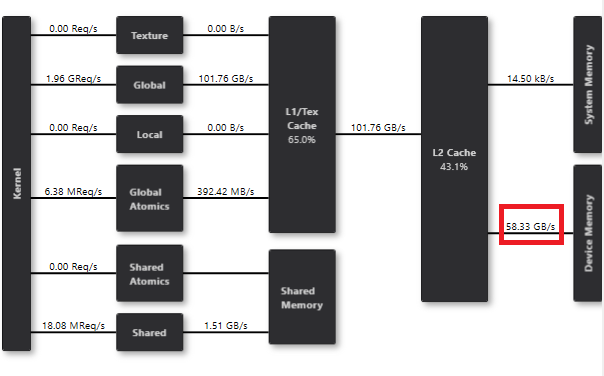

We reach only 58 GB/s with that code, 16% of peak. 


This should be used only when one or more of the following conditions are met:
- no other choice is available (lambda will actually be chosen at runtime by some third-party code)
- the lambda is extremely compute intensive
- this part of the code is not critical in the entire application


### Type Conversion Support

### Library Integration

### Streams

### Shared Memory

### Constant Memory

### Custom Marshalling
