# CUDA Basic concepts
Before talking about Hybridizer, we need a small introduction about GPU programming in CUDA. 
Key concepts are presented, such as block and threads. Comparing CPU and GPUs allows to understand the idea behind Hybridizer : work distribution and vectorization inference. 

## CUDA Threading
NVIDIA GPUs are made of Streaming Multiprocessors (SM), each containing what NVIDIA calls "CUDA cores". 

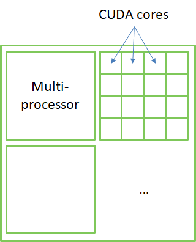

However, CUDA cores are **not** CPU cores. Indeed, they cannot operate independently (they run the same instruction on different data). 
They are more like SIMD lanes on CPU.  

Think:
- Multiprocessors (SM) as CPU cores
- CUDA cores as CPU SIMD lanes

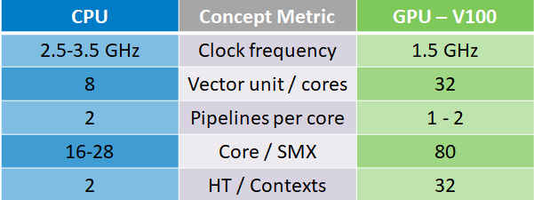


CUDA threading is a bit more complex than on a CPU:

- Threads are grouped in blocks
- Blocks are grouped in a grid
- Grids and blocks have configurable shape (1, 2 or 3D)
- 1 block run on a single SM


## CUDA functions

In CUDA, we write:
- `__global__` functions: executed on device, from the host
- `__device__` functions: executed on device, from the device
- `__host__`   functions: executed on host, from host (classic functions)

In device functions, we have access to special registers
- `threadIdx`: 3-dim structure identifying thread index in block
- `blockIdx`: 3-dim structure identifying block index in grid

In device functions, parallelism is *implicit*
- thread and block allocation is done at kernel launch

## Hello World

```c++
__global__ void add(double* a, double x, int N)
{
    int tid = threadIdx.x + blockIdx.x * blockDim.x;
    if (tid < N)
        a[tid] += x;
}
```


The code above is a simple CUDA C program, adding the value `x` to all elements of array `a`. As parallelism is implicit, no loop is involved (as long as `N` is smaller than the total amount of "*threads*". 
Here is the memory access pattern, given blocks have 4 threads: 

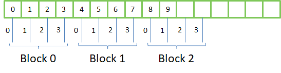

- `threadIdx.x` is between 0 and `blockDim.x - 1`
- `blockIdx.x`is between 0 and `gridDim.x - 1`

we can therefore address `gridDim * blockDim` elements in the array:

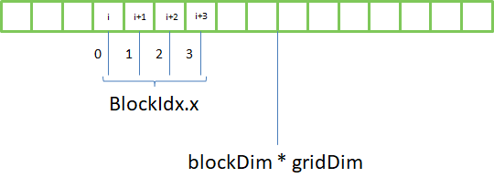

To access elements passed this boundary, we need a loop:

```c++
__global__ void add(double* a, double x, int N)
{
    int tid = threadIdx.x + blockIdx.x * blockDim.x;
    int step = gridDim.x * blockDim.x;
    while (tid < N) {
        a[tid] += x;
        tid += step;
    }
}
```

This loop is very important in CUDA, with or without Hybridizer. Targeting AVX/AVX2/AVX512, Hybridizer would infer vectorization from `threadIdx.x` usage. 

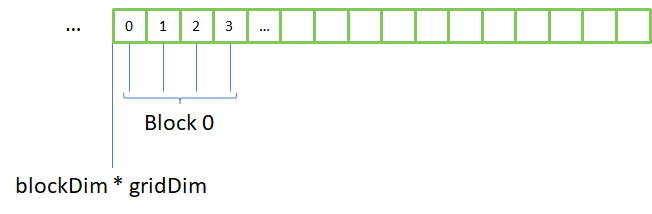

This is called *memory coalescence*, which is not mandatory, but performance critical in CUDA. 
Another way to access memory is to split data in identical slices, and assign each slice to a thread:


This is what is done by [openmp](https://www.openmp.org/) in a `parallel for` loop. This works well on a CPU, but not on a GPU:

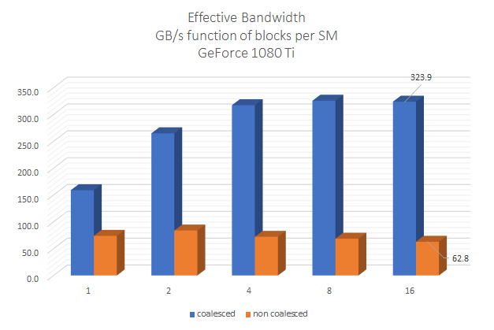


## GPU and system memory

GPU is physically distinct from the CPU. They stand on different places in the hardware, communicating through PCI-express or NVlink (for Power systems):

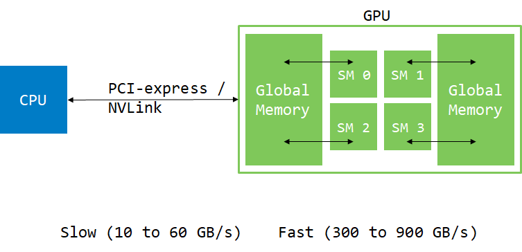

Usually, data comes from hard-drive or network. Therefore, it has to be moved to the GPU to be consumed there. We will see later that GPU can have direct access to the system memory (using pinned or managed memory), but data 
still has to move through PCI-express or NVLink at some point. 

```c++
int main() 
{
  const int N = 1024 * 1024 * 32;
  double *h_a, *d_a;
  h_a = new double[N];
  // allocate memory on device ..
  cudaMalloc(&d_a, N * sizeof(double));

  // move memory from host to device
  cudaMemcpy(d_a, h_a, N * sizeof(double), cudaMemcpyHostToDevice);

  // invoke kernel on device
  add<<<32, 256>>>(d_a, 1.0, N); // 32 blocks of 256 threads each

  // copy memory back to host
  cudaMemcpy(h_a, d_a, N * sizeof(double), cudaMemcpyDeviceToHost);
  
  // wait for device tasks to be done
  cudaDeviceSynchronize();
  // use result
} 
```

## Profiling

NVIDIA provides several profiling tools, such as [Nsight](https://developer.nvidia.com/nsight-visual-studio-edition),  [nvprof](https://docs.nvidia.com/cuda/profiler-users-guide/index.html#nvprof-overview) or [nvvp](https://developer.nvidia.com/nvidia-visual-profiler). 
Those tools can be used to accurately measure kernel execution time, code efficiency, or memory copies. 

### Timeline
Here is the *timeline* view of the execution of the above code:

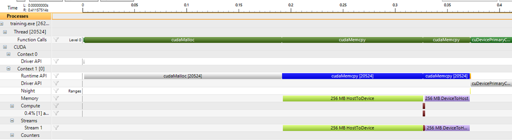

The first cudaMalloc call takes a lot of time, because driver has to initialize the CUDA context. Then comes the memory copy from host to device. Then a very little brown line : kernel execution, and then the copy back. 
 
This shows that moving memory around is really expensive and should be limited as drastically as possible. 

### Bandwidth
The memory tab shows us the effective bandwidth reached by this execution:

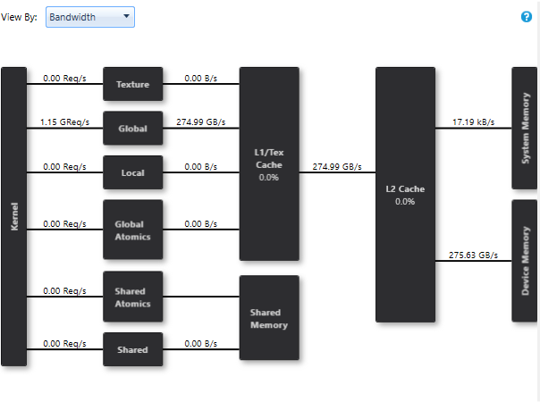

we see that kernel communicates with *Device Memory* at 275.63GB/s, which is 78% of peak on this device (GeForce 1080 Ti). 

To get hints about improvement room, we need to have a look at another tab:

### Issue efficiency
Here is the *issue efficiency* view of that execution:

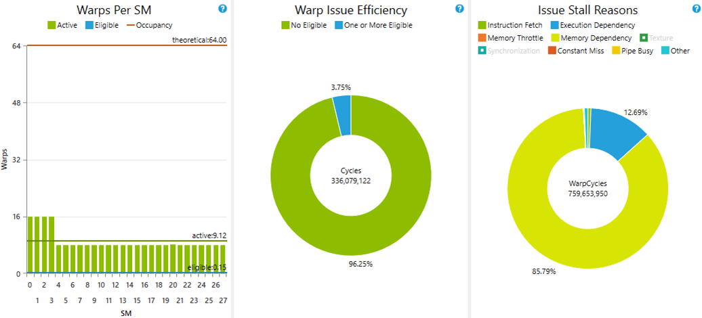

The left panel shows that only 8 to 16 warps (group of 32 threads) were active at the same time per SM. But the limit is 64 (because our kernel consumes very few registers). We can therefore see that 85% of time, instructions are stalled because of memory dependency (right panel). 
Indeed, accessing global memory from SM takes a lot of latency (around 400 cycles). Several warps must be scheduled at the same time to hide that latency. 

If we rerun this kernel with 8 blocks per SM (8 * 256 = 2048 = 64 * 32 = 64 warps):

```c++
cudaDeviceProp prop;
cudaGetDeviceProperties(&prop, 0);
int smCount = prop.multiProcessorCount;

// ...

add<<<8 * smCount, 256>>>(d_a, 1.0, N);
```
 we get this new profiling result:

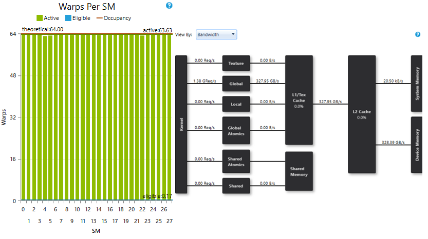

where SM are saturated with enough warps, and reached bandwidth is 328.39GB/S, which is 93% of peak. 

## Important notice

|        | CPU | GPU |
|:-------|:---:|:---:|
| Cores  | 22 (Xeon)  | 80 (Volta) |
| SIMD   | 8 (AVX512) | 64 cores per SM (Tesla) |
| Contexts | 2 (hyperthreading) | 32 (to hide latency) |
| total parallelism | up to 704 | up to 164000|

- GPU threads are **not CPU threads**! Work has to be scheduled in a different way. 
- The level of parallelism which can be reached is much higher on a GPU than on a CPU. Therefore enough work has to be scheduled to use the entire compute power of the device. This can be done by large or numerous enough kernels at the same time.