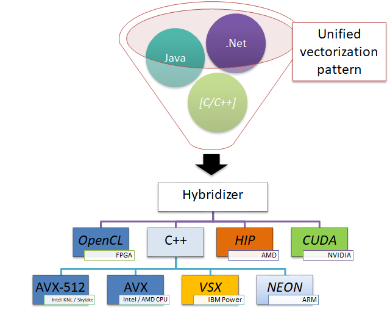
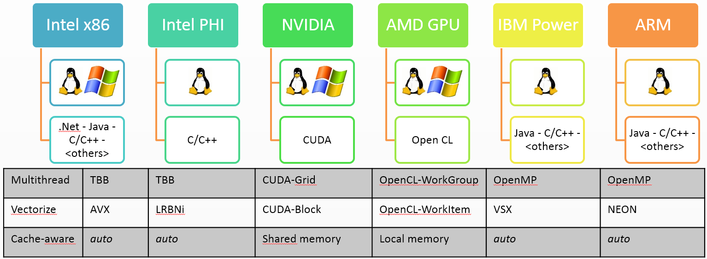
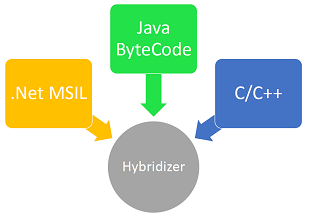
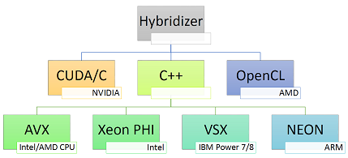
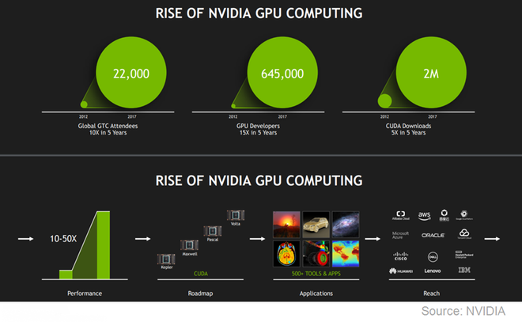

# What is the Hybridizer

The aim of the Hybridizer is to let the user seamlessly use different hardware execution environments. It integrates in the compilation tool--chain: from some intermediate language, it generates source code for different types of architectures. The Hybridizer abstracts the specific SDK and other language features of processors hence reducing the learning curve to many--core processors enablement.

This chapter briefly describes the overall picture of the Hybridizer: how it operates, its inputs and outputs and the various processing elements it offers.

## Hybridizer in Operation

The Hybridizer operates on intermediate language, that is code that has been compiled to be either executed by a virtual machine, or compiled to machine code. The input intermediate languages are:

- MSIL: MicroSoft Intermediate Language - that is the dot net platform.
- Java Byte Code: the binary format of java.
- LLVM-IR: the intermediate representation of LLVM.

Then, depending on the selected Flavor (see Chapter [flavors](#flavors)), the Hybridizer will generate source code with all the necessary annotations and code hints to make use of the specific features of each hardware architecture.

In essence, from a single version of the source intermediate language, several platforms may be targeted. 

# Hybridizer Processor Ecosystem

The Hybridizer can generate source code optimized for a variety of hardware architectures. Allowing the user to embrace, with a single version of the source code, execution platforms ranging from low-powered platforms such as ARM processors, to high--end GPUs, through conventional CPUs constantly offering wider vector units.

The Hybridizer aims at shortening the learning curve to new platforms, allowing the developer to reuse existing concepts applicable to a platform on another execution platform. For example, the CUDA work distribution pattern can be used to take full benefit of AVX platforms. Figure below illustrates how the parallelization challenges may be addressed.

Note that almost each architecture has his own SDK to enable features that address the parallelization challenges. For example, CPU and GPU don't share any concept: multi--threading may be done using OpenMP on CPU but has to be implemented otherwise on GPU. Even though some vectorization concepts may be shared between CPUs, they do not map on GPU as the GPU exposes more features: SIMT enables more than SIMD.

In this chapter, we review the different hardware architectures we address and their associated concepts to solve the parallelization challenges.

## Intel and AMD x86

These are the most commoditized processors. The instruction set has constantly expanded yet maintaining a binary compatibility with former generations. The latest available processors offer AVX instructions, enabling SIMD on 4 double precision or 8 single precision registers. Moreover the number of cores in such processors has not stopped increasing in the past decade, starting at 1 in 2004 up to 18 in 2014. Besides the decrease in clock, this processor family is in constant improvement.

Making use of the full capacity of this hardware requires usage of multiple concurrent threads to use the multiple cores on the processor, and vector operations to make use of the AVX facility. Finally, memory bandwidth increases at the cost of latency, constantly pushing the register count and cache at the center of the optimization effort.

### Parallelization Challenges

#### Multithreading

Multi--threading can be addressed in different ways. Intel proposes [Threading Building Blocks](https://www.threadingbuildingblocks.org/), a C++ template library that allows developer to make use of multicore architectures. The OpenMP standard may also be used, in a wider variety of platforms. It is available in various programming languages including C, C++ and Fortran, and implemented by a vast majority of compilers. The basic concept is to cut a problem into several tasks of similar complexity, have those run on separate cores, and gather results.

These tools helps the developer pay attention to concurrency issues, either automatically or hint-based. The automated approaches sometimes end-up in false sharing: when the compiler runs into a code configuration where some data cannot be defined as constant, that is the compiler does not have enough hints and understanding to define that the data is constant, it would generate a locking mechanism around data that is in fact constant, or for which such locking is unnecessary. As a result, concurrency protection might lead to strong performance degradation with little warning.

One may also implement multi--threading by hand using thread libraries such as pthreads.

#### Vectorization

Vectorization on x86 architectures can be done relying on vectorizing compiler, with annotations to help the compiler identify opportunities such as `#pragma simd` or `const __restrict` annotations. However, if the code expresses a construct that is not supported by the compiler, the vectorization will not occur. It is also possible to use intrinsics to explicitly use AVX operations.

The explicit use of intrinsics ensures code to generate AVX instructions, and inlining usually operates well in this case. However, register counting and stack behaviour cannot be controlled. More control requires inline assembly, and is compiler dependent.

#### Cache-awareness

There is very little cache control on x86 processors. Two operations are available: cache invalidation and memory prefetch. The first operation clears all cache association, usefull when changing context. Though, stack memory goes out of cache in that way. The second, memory prefetching, allows some region of memory to be loaded in cache. However, since we have little control on cache loading, it is very hard to optimize automatically.

Using local variables to store reused data, and operating on local variables offers a good hint on how to best use the cache: indeed the stack is most often in cache, and represents contiguous memory. 

## NVIDIA GPU

Since 2004, the graphics processor overcomes the conventional processor in terms of raw compute power. Since then, using Graphical Processing Units (GPU) for General Purposes calculations (GPGPU) has been explored [BrookGPU](https://en.wikipedia.org/wiki/BrookGPU). In early 2007, NVIDIA introduced the CUDA development environment making such usage of the GPU common place. Today, many high-end supercomputers make use of GPUs to accelerate their calculations [Top500](https://www.top500.org/list/2018/11/).

Using an NVIDIA GPU for general purpose calculations is best done using CUDA. This environment requires usage of specific annotations/registers to distribute work on the GPU. This work distribution framework largely taught in universities today, is one of the possible ways to express parallelized work in the Hybridizer.

### Parallelization Challenges

#### Multithreading

NVIDIA GPUs are made of Multiprocessors, SMX in the case of Kepler, that hold a group of CUDA cores. A CUDA block offers shared memory, L1 cache, and other related concepts. We map these concepts to CPU threads for our Multi--threading challenge. The shared memory of the CUDA block may be seen as the stack of the logical thread. Multi--threading is then performed assigning tasks to separate blocks, using the `blockIdx` concepts. 

Dynamic parallelism offers more control allowing a form of synchronization together with events.  Since CUDA 9.0 and Pascal architecture (TCC mode only), grid synchronization is allowed by [cooperative_groups](https://devblogs.nvidia.com/cooperative-groups/). 

#### Vectorization

CUDA threads are mapped onto vectorization concepts. Indeed, for a given wrap, composed of 32 entries, a single operation may be performed; which is similar to the features of a CPU vector unit. Vectorization is thus performed explicitly using `threadIdx` and related concepts.

#### Cache-awareness

The SMX hold a region of very fast memory. It can be either automatically used with L1 cache, or explicitly with shared memory. We map the stack allocation concepts to either local variable declaration or onto shared memory depending on developer choice. Indeed a local variable is either per vector-unit or per thread.

# Input

 The Hybridizer operates on different types of inputs. As show in figure below, different intermediate languages are being supported. The Hybridizer, takes as input a configuration file, referencing one or several intermediate language files (e.g. dotnet binary, java archive). It then produces source code (with Hybridizer Software Suite) or compiled binary (with Hybridizer Essentials). This chapter describes the types of input supported, the associated limitations, as well as the configuration file format. 
 
 
 
## MSIL

The Hybridizer operates on MicroSoft Intermediate Language in binary form, that is a dotnet assembly. With the associated attributes, the assembly is processed, extracting all methods that need to be transformed into target source code. These attribute describe the way code should be transformed. 

Functions from external libraries that are explicitly used by the code to be transformed will automatically be searched and transformed as well. Note that other implementations of a virtual function or interface functions defined in a separate assembly might be refered explicitly in the configuration file.

### Known limitations

As of today, it is not possible to use the following constructs and features within the code to be transformed:

- Allocating class instances, that is heap data, is not supported.
- String type is not supported.
- Catching and Throwing exceptions is only partially supported.
- Using lock regions is not supported.
- `foreach` is not supported as it holds a `try/catch` and some heap-related operation.
- recursion is not supported. However similar feature may be achieved using interfaces (see error code 0x6005 \ref{errorcode:0x6005}).
- generic functions are not supported, although generic types are.
- some combination of generic types with vectorization (C++ targets such as AVX) are not supported.

## Java Byte Code

Java byte--code may be used as input. It is converted to MSIL binary either with IKVM, or with a tool provided within the Hybridizer Software Suite. The few operators from Java Virtual Machine not implemented in dot net virtual machine (such as stack swap operators) are reimplemented in dot net. The resulting dot net assembly is then processed as if it were generated from a dot net language, enabling all the features (debugging, profiling).

# Flavors

The numerous outputs of the Hybridizer are called Flavors. Flavors define the language or jargon in which the Hybridizer outputs code. This output is then compiled using the appropriate compiler to generate machine code for the target architecture. Figure below illustrates the various outputs of the Hybridizer.

## OMP

This flavor is a plain C/C++ flavor enabling some support for OpenMP features. For this flavor, the Hybridizer does not offer much performance improvement or new features. This flavor may be used as a testing environment to disambiguate issues between input code core processing and flavor source-code generation.

For example, should the generated code provide accurate values for OMP but not for CUDA (for example), it might be that the code is not parallelization safe, that is work distribution is incorrect.

Indeed, OMP code, if compiled without any OpenMP library/compiler, is a plain sequential execution of the algorithm.

Note however that OMP code will output plain C++ code that may be used as input for an optimizing compiler which might generate better machine code than what the JITer would provide, hence offering performance improvements.

## CUDA 

For this flavor, the Hybridizer generates source code (or binaries), cu files, that may be interpreted by NVIDIA CUDA C compiler (a.k.a. nvcc). Methods are declared using `__device__` or `__global__` attributes should they be called from the host or the device. For each entry point, `__global__` methods, wrappers are generated as C symbols, facilitating runtime calls. 

### Naming Conventions and Intrinsics

CUDA has a wide adoption in the massively parallel computing community. With almost half a billion cuda capable GPUs, and 1.6 million CUDA downloads, the popularity of the environment for massively parallel software development is established:

Work distribution on CUDA is done with blocks and threads. In this terminology, threads are a unit of work execution, and blocks are groups of threads. Threads in the same block might share more easily data, where blocks are more independent:

n Hybridizer, the work distribution may be done using the same terminology. For the CUDA flavor, there will be a one--to--one mapping, where for other flavors, mapping will be adapted at its best. The naming convention from CUDA is mapped to allow a seamless integration of CUDA-enabled algorithms in the environment of the Hybridizer.

This naming convention mapping is conveyed using Intrinsics. Any method, or getter from properties, may be marked with an Intrinsic attribute: either `IntrinsicConstant` or `IntrinsicFunction`. When generating code for the target, the method call will be replaced by the intrinsic constant or function. The mapping of `threadIdx` CUDA entity is done setting an IntrinsicConstantAttribute on the getter of some property.

### Specific features

CUDA offers a number of features which are not present in other hardware architectures.

Some of those are expressions of concepts that can be mapped onto other processors. For example, shared memory, which is exposed using different API elements, can be mapped to a region of memory allocated on the stack: the memory is shared amongst cuda--threads, that is vector unit, but not shared amongst cuda--blocks, which can be seen as posix-like threads. Indeed, when allocating memory on the stack, that memory is very likely in cache, mimicking the behaviour of CUDA.

However, some features are entirely specific to CUDA, such as shuffle instructions, and those are hardly mapped on other hardware. Moreover, such features sometimes require custom API to be properly expressed.

## General Vector Flavors

For hardware for which general purpose C/C++ compiler, like g++, is available, the Hybridizer generates C++ code using a micro--library for vectorization. The implementation of this micro--library is specific to each hardware architecture, but its general interface is common. Several flavors build on this concept.

### AVX

This flavor implements a micro--library using AVX intrinsics. A compilation flag allows usage of AVX $2.0$ if available. It may be used for Intel or AMD processors.

### AVX512

This flavor implements a micro--library using MIC micro--architecture instructions. These instructions use 512bits wide vector registers.

### POWER

This flavor implements a micro--library using VSX micro--architecture instructions.

### NEON

This flavor implements a micro--library using NEON micro--architecture instructions, available on some ARM processors. 